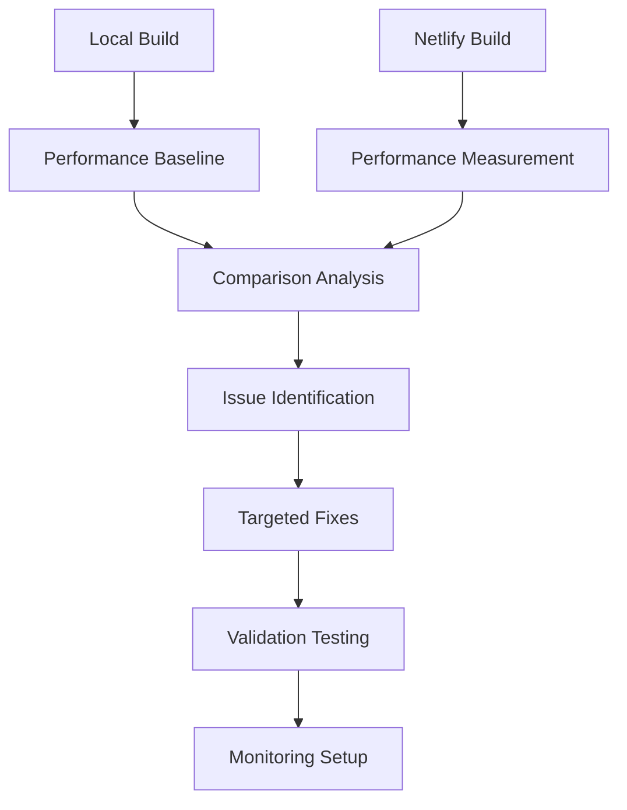

# Design Document

## Overview

The performance discrepancy between local builds (100 score) and Netlify deployment (75 score) is likely caused by a combination of deployment-specific factors including network conditions, asset optimization settings, and Netlify's build environment differences. This design outlines a systematic approach to identify and resolve these issues through configuration optimization, monitoring implementation, and targeted performance improvements.

## Architecture

### Performance Analysis Pipeline



### Deployment Optimization Strategy

1. **Asset Optimization Layer**: Enhanced compression, caching, and delivery
2. **Build Configuration Layer**: Optimized Netlify build settings
3. **Monitoring Layer**: Continuous performance tracking
4. **Alert System**: Automated performance regression detection

## Components and Interfaces

### 1. Enhanced Netlify Configuration

**Purpose**: Optimize asset delivery and caching strategies

**Key Features**:
- Advanced compression settings (Brotli + Gzip)
- Optimized caching headers for different asset types
- Asset optimization controls
- Build performance settings

**Configuration Structure**:
```toml
[build.processing]
  skip_processing = false
[build.processing.css]
  bundle = true
  minify = true
[build.processing.js]
  bundle = true
  minify = true
[build.processing.html]
  pretty_urls = true
[build.processing.images]
  compress = true
```

### 2. Performance Monitoring System

**Purpose**: Track and compare performance metrics between environments

**Components**:
- Lighthouse CI integration
- Performance budget enforcement
- Automated testing pipeline
- Metrics dashboard

**Interface**:
```javascript
// Performance monitoring configuration
const performanceConfig = {
  budgets: {
    performance: 90,
    accessibility: 95,
    bestPractices: 95,
    seo: 95
  },
  thresholds: {
    fcp: 1500,
    lcp: 2500,
    cls: 0.1
  }
}
```

### 3. Asset Optimization Pipeline

**Purpose**: Ensure optimal asset delivery across environments

**Features**:
- Pre-compression of static assets
- Image optimization validation
- Font loading optimization
- JavaScript bundle analysis

### 4. Build Environment Alignment

**Purpose**: Minimize differences between local and production builds

**Components**:
- Environment variable standardization
- Build flag optimization
- Dependency version locking
- Cache strategy alignment

## Data Models

### Performance Metrics Model

```typescript
interface PerformanceMetrics {
  environment: 'local' | 'netlify';
  timestamp: Date;
  lighthouse: {
    performance: number;
    accessibility: number;
    bestPractices: number;
    seo: number;
  };
  coreWebVitals: {
    fcp: number;
    lcp: number;
    cls: number;
    fid: number;
  };
  networkMetrics: {
    totalBytes: number;
    resourceCount: number;
    compressionRatio: number;
  };
}
```

### Issue Tracking Model

```typescript
interface PerformanceIssue {
  id: string;
  type: 'compression' | 'caching' | 'bundling' | 'network' | 'rendering';
  severity: 'low' | 'medium' | 'high' | 'critical';
  description: string;
  impact: number; // Performance score impact
  solution: string;
  status: 'identified' | 'in-progress' | 'resolved' | 'verified';
}
```

## Error Handling

### Build-Time Error Handling

1. **Configuration Validation**: Verify Netlify settings before deployment
2. **Asset Verification**: Ensure all assets are properly optimized
3. **Performance Budget Checks**: Fail builds that don't meet performance thresholds
4. **Rollback Strategy**: Automatic rollback on performance regression

### Runtime Error Handling

1. **Graceful Degradation**: Fallback strategies for failed optimizations
2. **Monitoring Alerts**: Real-time notifications for performance issues
3. **User Experience Protection**: Maintain functionality during optimization failures

## Testing Strategy

### Performance Testing Approach

1. **Baseline Establishment**:
   - Document current local build performance
   - Establish performance budgets
   - Create test scenarios

2. **Comparative Testing**:
   - A/B test configuration changes
   - Before/after performance measurements
   - Cross-environment validation

3. **Automated Testing Pipeline**:
   - Lighthouse CI integration
   - Performance regression testing
   - Continuous monitoring setup

### Test Scenarios

1. **Asset Delivery Testing**:
   - Compression effectiveness
   - Caching behavior validation
   - CDN performance verification

2. **Build Optimization Testing**:
   - Bundle size analysis
   - Code splitting effectiveness
   - Tree shaking validation

3. **Network Performance Testing**:
   - Different connection speeds
   - Geographic distribution testing
   - Mobile vs desktop performance

### Validation Criteria

- Performance score improvement to 90+
- Core Web Vitals within "Good" thresholds
- Asset compression ratios > 70%
- Cache hit rates > 95% for static assets
- Build time impact < 10% increase

## Implementation Phases

### Phase 1: Diagnosis and Baseline
- Comprehensive performance audit
- Environment comparison analysis
- Issue identification and prioritization

### Phase 2: Configuration Optimization
- Enhanced Netlify configuration
- Asset optimization improvements
- Build process optimization

### Phase 3: Monitoring Implementation
- Performance tracking setup
- Alert system configuration
- Dashboard creation

### Phase 4: Validation and Refinement
- Performance testing and validation
- Fine-tuning based on results
- Documentation and maintenance procedures